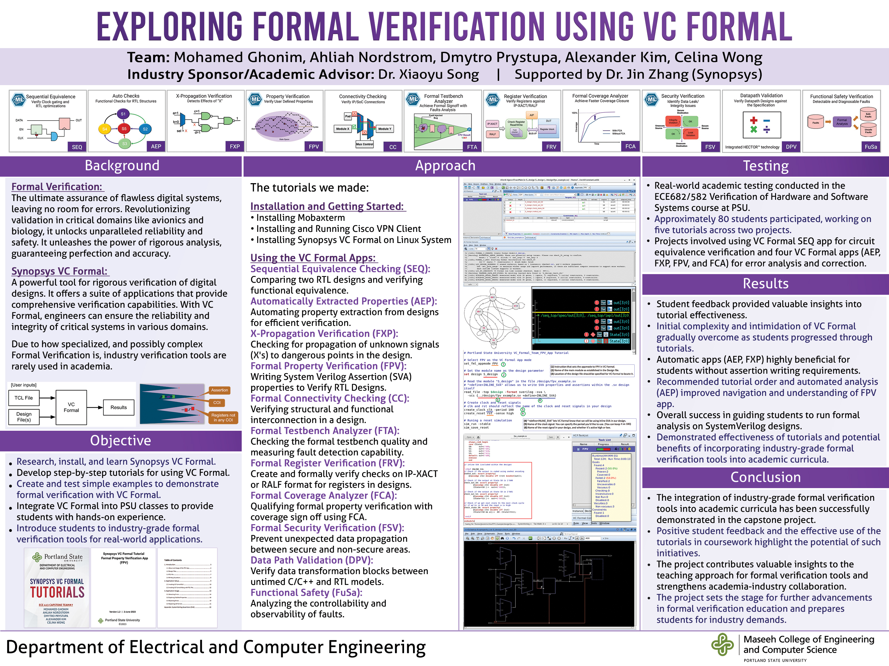

# Documentation Tutorials Repository
This repository is dedicated to providing a comprehensive guide and practical examples for using VC Formal for formal verification. Our goal is to help both beginners and experienced users understand the principles of formal verification and how to apply them effectively using VC Formal.

